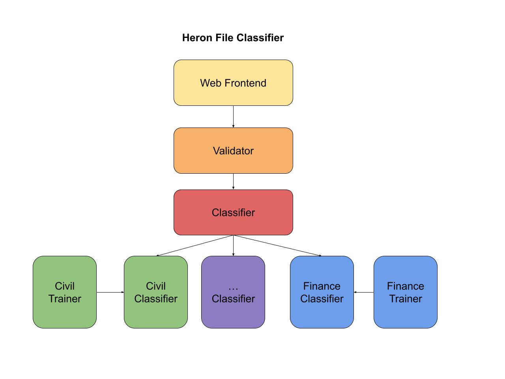

# Heron Coding Challenge - File Classifier Write-up


## Overview

The original classifier only classifies files based on their filenames, which is subject to errors like typos, misspellings, etc. Most importantly, the filename does not necessarily correctly indicate the file's content. In addition, it is not scalable to support other types of files from different industries.

In this repository, I extended the classifier with the following capabilities:

- Added a web frontend interface to facilitate testing and user interaction. Users only need to click a button to upload a file and get the classification result.
- Separated file validation from file classification, making the code more maintainable and modular.
- Used MIME type to validate file types rather than file extensions, and added support for more file types including:
  - Documents (PDF, Text, Word, Excel, PowerPoint)
  - Images (JPG, PNG, GIF, BMP, WebP, SVG)
- Redesigned the classifier to have a two-level structure:
  - Industry classification followed by file type classification for each specific industry
  - More scalable for future industry additions
  - Currently supports civil and finance industries (due to time constraints)
- Built industry-specific classifiers using pre-trained logistic regression models:
  - More advanced models like neural networks could be used to improve accuracy
  - Training data is generated synthetically using generative AI models like Claude-3.5-Sonnet
- Updated the tests to exercise new functionalities
- Added a CI workflow with Github Actions

## System Architecture



## Usage

1. Clone the repository:
   ```shell
   git clone <repository_url>
   cd join-the-siege
   ```

2. Install dependencies:
   ```shell
   python -m venv venv
   source venv/bin/activate
   pip install -r requirements.txt
   ```

3. Run the Flask app:
   ```shell
   python -m src.app
   ```

4. Test the classifier using the [web frontend](http://127.0.0.1:5000/). Upload a file from the `files/` directory to see the classification result.

Note: it may take a while for the system to classify images initially as it needs to download some dependencies.

5. Run tests:
   ```shell
   pytest
   ```
